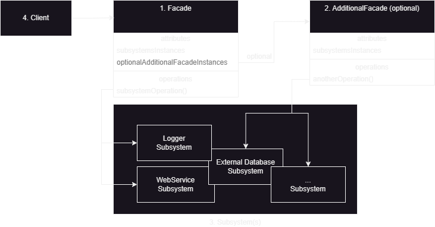

The Facade pattern is a structural design pattern that aims to simplify the usage of a complex system by providing a streamlined interface. It acts as a "facade" or a simplified front-facing interface that shields the client code from the underlying intricacies of the system.

The main objective of the Facade pattern is to offer a unified, higher-level interface that encapsulates and simplifies interactions with one or more subsystems, which can consist of multiple services or classes. By doing so, it fosters loose coupling and enhances code maintainability by reducing dependencies between the client code and the subsystems. Additionally, this abstraction introduced by the facade interface facilitates testing and allows for easier implementation of dependencies and mocks.

1. **Facade**
   * It is the central class that provides a simplified interface for the client code to interact with the complex system. It delegates the client's requests to the appropriate subsystems or classes.
2. **Additional Facade** _(optional)_
   * Multiple facade classes can be created to prevent a single facade from becoming cluttered with unrelated features. This approach helps avoid complex structures and allows for better organization. These additional facades can be utilized by both clients and other facades, promoting a more modular and maintainable design.
3. **Subsystem(s)**
   * It represents the individual components or classes that form the complex system. These subsystems have their own methods and functionalities. The facade class interacts with the subsystems to fulfill the client's requests.
4. **Client**
   * It is the code that interacts with the facade to access the complex system. The client code is shielded from the complexities of the subsystems and interacts only with the facade

